## 需求说明：
    
    1.组件化构建整体界面，每个位置对应一个view用来存储需要展示的车号和类型号，（组件和数据要进行分离，）
    思路：显示的车号和类型号，绑定到udt批量生成的tag中，利用脚本批量生成udt类型的tag实例，
    
    2.组件前面需要复选框代表选中，复选框选中的同时，加上选择特效，比如加粗或者斜体之类，
    思路：绑定复选框的选中事件，选中则修改label中的文字属性，
    
    3.增加功能：在对应位置输入车号和类型号后，点击按钮，数据增加到现有列表的第一个位置，其他数据依次后移，
    思路：因为当前显示页面的要求是不能对展示的数据直接进行编辑，要间接编辑，所以，增加的组件和显示的列表组件不能通用，不用抽象，修改按钮和增加的功能类似，可以抽象为一个组件？那么修改的界面就不能绑定tag实例，考虑到复用的情况，修改的逻辑改成，点击修改按钮时，获取当前列的数据后，临时变量存储起来，并展示在界面上，界面上点击确认后，将文本框内的数据，写入到之前获取的复选框中。
    
    4.修改按钮的逻辑改为，点击后生成一个弹窗，弹窗内应有当前选中的数据和可以修改数据的文本框，还需要有确认按钮，以及确认后弹窗提醒？并自动关闭当前修改窗口？
~~思路：修改按钮绑定一个生成弹窗的事件，如何生成弹窗暂未了解，待学习，应该是类似view的界面组件，通过按钮事件渲染出来？修改数据的文本框，此处可以做成之前的逻辑，即在原有的数据上进行修改，将文本框中输入的数据传入到对应的tag中，确认后弹窗的逻辑同修改按钮弹窗的逻辑？弹窗后，过1秒到3秒自动关闭修改相关的所有界面？~~
    修改逻辑更改：不再进行弹窗提示，改为复选框选中个数为1时才执行操作，以及，当有一个复选框选中时，~~其他复选框设置为不可选，~~不可行，复选框选中操作发生在点击按钮之前，调整为，只有选中数量为1时才弹窗，其他情况都不弹窗，弹窗传递idnum，即将popup设置传递idnum参数，选中多个时，按钮无法操作，只有选中一个时，按钮才能继续操作
    
    5.修改界面考虑增加一个还原按钮，用来还原当前修改界面的数据
    思路：还原，通过选中时，获取选中行的数据，并进行临时存储，若点击还原则将存储的数据，重新写入，否则就不用管
    
    6.移动按钮，同样改成点击弹窗，在对应界面上进行修改，当前移动逻辑同之前的逻辑，仍然是复选框代表选中，或许可以不增加移动界面，复选框的选中和数据的移动要同步，即，移动数据后，复选框跟着移动，以及，点击后，在最大值最小值内的复选框自动勾选，///////第二种界面逻辑，拥有界面，通过下拉框，以及在下拉框右侧增加一个显示车号的标签，通过头下拉框和尾下拉框代表数据的选中，简单添加一个弹窗，提示最大值应大于等于最小值，并重置下拉框的数据，还有一个距离下拉框，代表移动的距离，设置同之前的样例，
    思路：考虑采用第二种界面，第一种界面可以作为之前方案的完整补充，点击弹窗仍然是按钮事件，移动逻辑通过获取，头尾下拉框的序号，来获取界面上对应的车号，并将数据显示在对应标签上，弹窗提醒，点击移动后才会弹窗提醒，不点击则没提醒，最大值最小值校验通过后，才会进行移动的逻辑，获取距离下拉框中的值，进行移动的动作，移动的动作完成后，弹窗提醒操作成功，不退出当前界面，在可以查看数据的考虑下，可以提供多次移动的依据，移动界面可以实现单个数据的移动，需要有退出按钮，退出当前界面，
~~7.每次的弹窗提示信息，都需要一个小窗口来显示相应的信息，~~
~~思路：对所有可能涉及到的窗口进行复用，那么需要一个可以传递提示信息的参数，没了，ignition自带x号，可以关闭当前窗口~~ 考虑不做小的提示弹窗
## 难点及注意事项：
1.udt的创建及应用--已解决：
    udt实例的创建需要模拟设备中有实际的tag点，目前得知，实际plc设备中，添加后，会自动出现实际设备点，通过multi instance wizard功能实现多实例的udt创建，如下图所示，选择udt模版后，设置tagname和pattern，pattern代表递增的序号或者说规律的变量？应该可以自行添加表达式来构建逻辑（待验证）,pattern是参数的pattern，需要和下面列表中的pattern相同，
    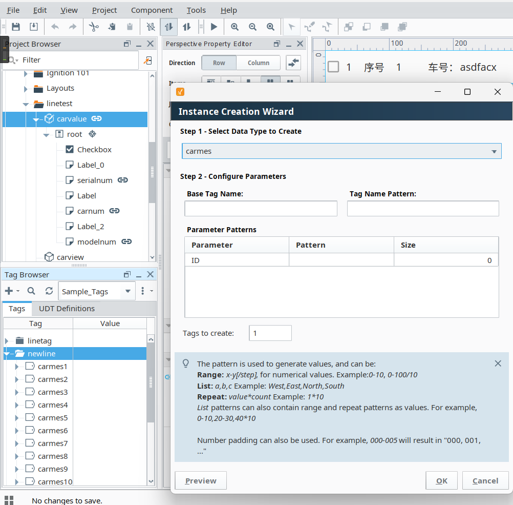
    
创建udt时，如果要和实际设备相映射，可通过{}中添加动态变化的参数来实现批量创建，具体可见inductive university官网，~~后续数据流动时的机制还不明确~~

    补充：数据之间的传递仍然以tag为主，通过tagpath直接访问对应tag的值，界面上的控件，通过添加params参数绑定到对应需要的控件，并添加脚本事件以获取控件的值，然后直接通过对应路径访问控件值即可。

2.view视图与udt的绑定--已解决：
    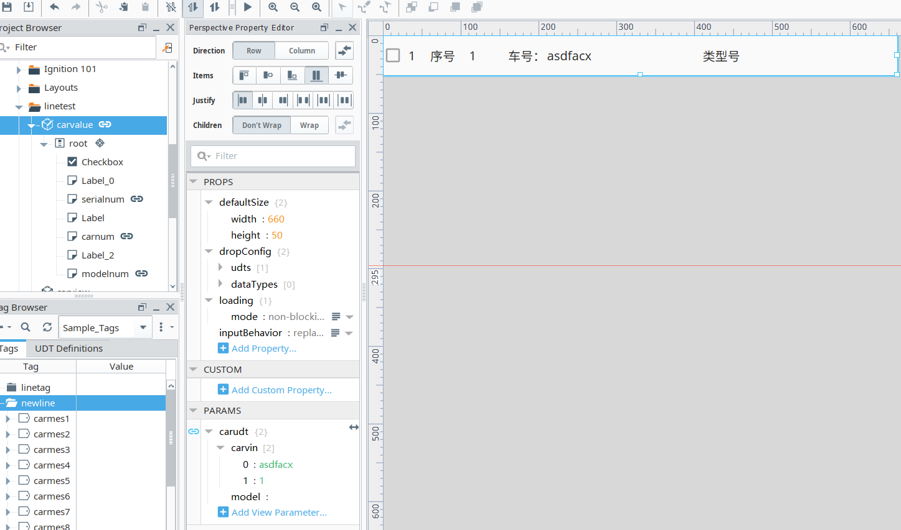

    通过添加params参数，来实现，数据的传递以及view视图的批量应用，params参数通过新建后，自命名一个参数，然后可以绑定到实际的udt实例上来获取对应udt实例的相关参数，取消绑定后，之前绑定留下的参数仍然在

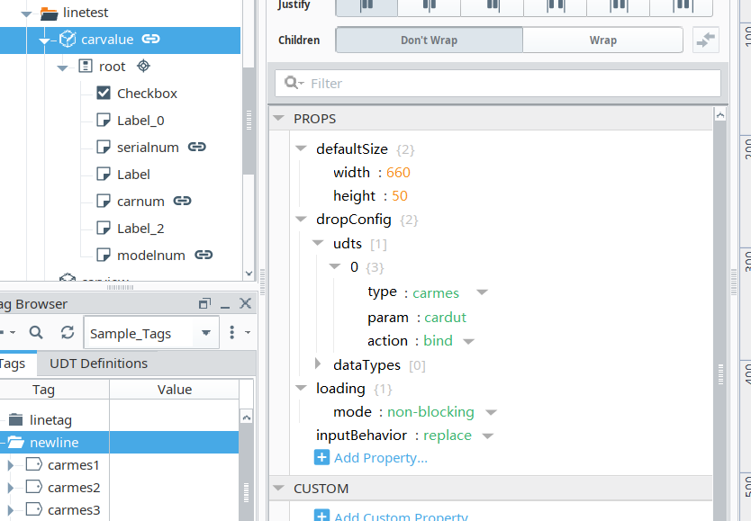
    
    在dropconfig中，可以设置udt模版，type设置udt模版，param设置，之前增加的params即参数的名称，action设置为bind代表会绑定到对应udt实例，

补充：select复选框组件的参数以及值传递如下图所示，直接新建value，键值对不能绑定，建立对象后可以绑定布尔值，且键值对只能命名为boolean，尝试换其他命名时，仍然会自动增加一个boolean字段

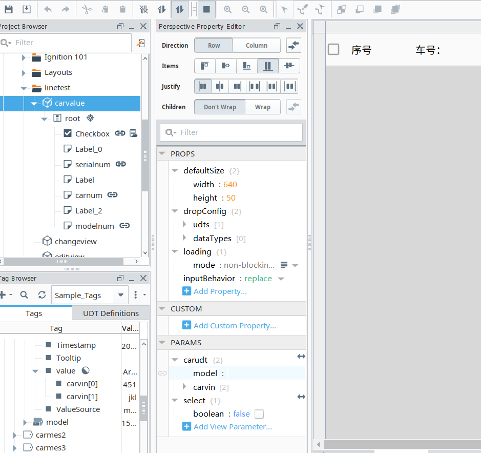

3.复选框与字体样式修改--解决：

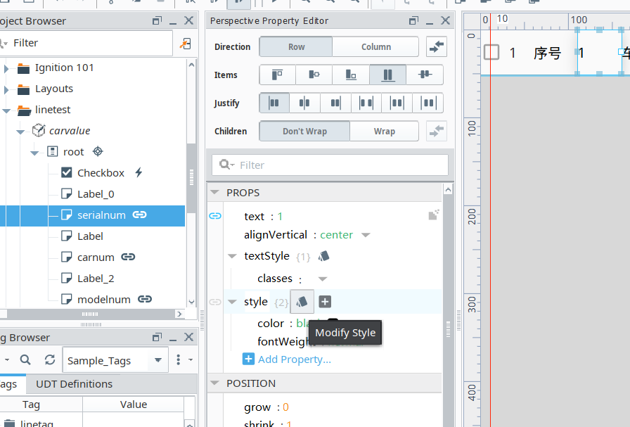

通过编辑style属性，如图所示，点击该帐篷样式的图表后，会进入样式列表，在其中可以修改字体样式，

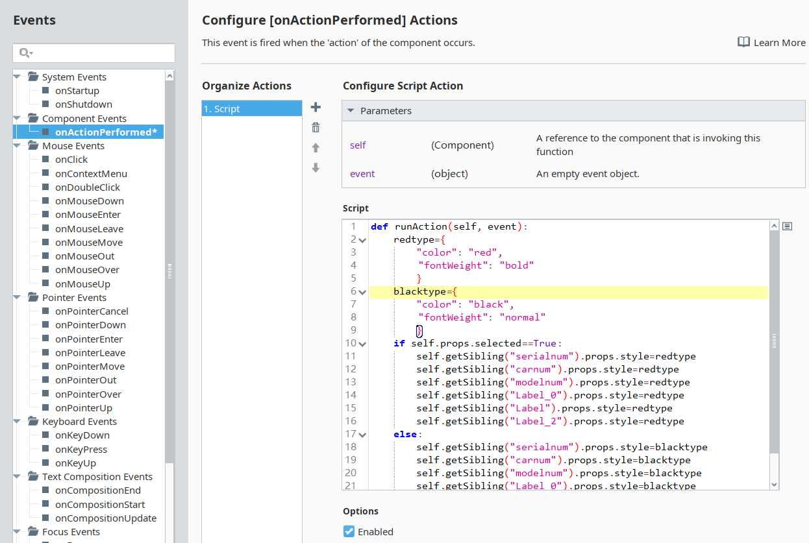

绑定事件通过直接设置style格式来修改即可。

4.增加和修改的复用组件--解决：   
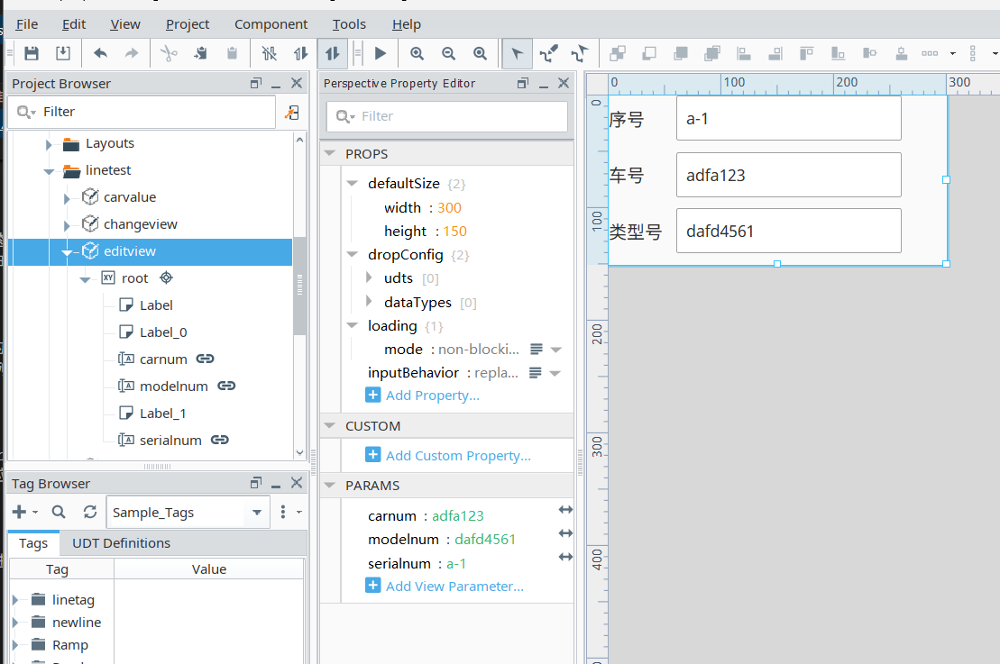

    通过添加params里面的参数，并且，让对应文本框的值绑定到对应参数上，可以实现，数值的传递，参数反过来绑定文本框不可行，推测是路径问题，

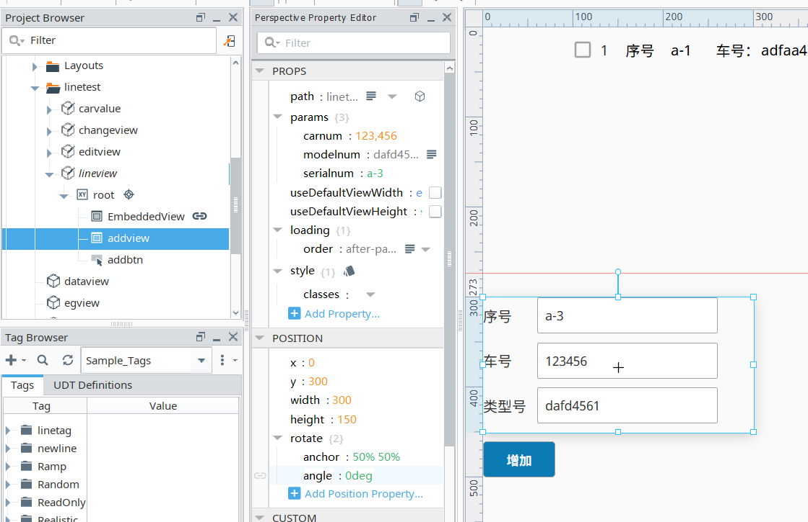

    绑定之后，在新页面的对应位置，即props中的params中添加，该view视图自行设置的参数，即可进行编辑和参数的传递。

    此处少了一个步骤，完成对应的params属性绑定后，需要添加一个文本框的脚本事件，

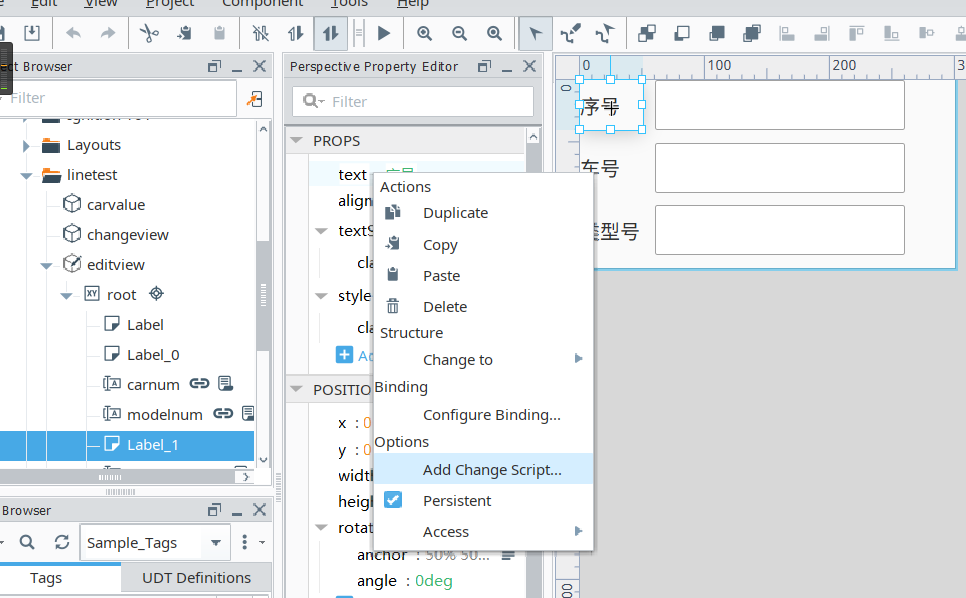

    没有添加脚本时，是这个状态，添加改变脚本，一旦文本框中的值改变后，将文本框内属性赋值给params，代码如下图所示
    
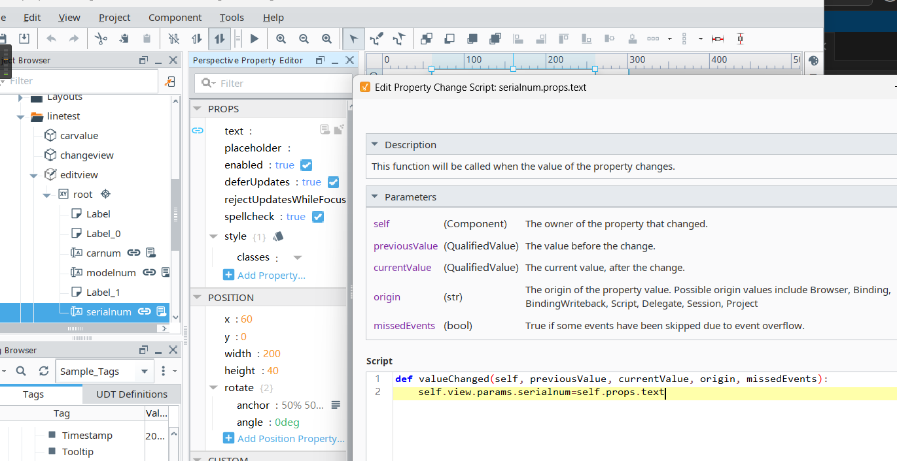

5.修改界面的参数传递逻辑--~~待解决~~   解决
popup弹窗可以通过参数传递值，但是传递的前提是队列页面中，存在可以传递的数据，那么是通过修改按钮，获取当前页面被选中的值，同时需要判断，若选择框的数量大于1个，则提示选择太多，没有选择则提示请选择数据？有一个时，则获取被选中的数据，按钮需要添加三个参数，对应存储被选中列的数据，对应上，修改页面需要的三个参数，然后通过修改页面提供的三个参数与复用组件进行通信，即，弹窗时，将数据传递给复用组件的参数以显示在文本框上，点击确定时，~~直接传递当前文本框，即复用组件参数的数据给到修改页面的参数数据，/////不需要，点击确定后~~，直接传递文本框的数据到对应的tag中，

优化逻辑：可以尝试跳过传参过程......直接通过tag值来改变？？？直接通过tag值，那么步骤上没有太多变化，仍然需要修改按钮判断，当前选中的是哪个位置的tag，但是数据可以直接通过tag来确定，传参只需要传递一个ID参数即可，跳过繁琐的ui数据传递过程，后续，文本框显示的数据仍然需要通过界面的参数来传递？但是不用设置显性的数据存储，通过id，因为tag标签是有序的，id相当于是当前tag的数据集合，文本框的参数也可以通过直接访问tag得知，确认逻辑同理，确认后，直接将当前文本框内的数据传递给tag，那么tag会顺带修改对应label的值，不再需要手动修改label，还原过程同样可以简化，没有点击确认时，而是点击了还原，那么将对应tag的值，再次写入到复用组件的参数中，复用组件就会自动显示当前tag的初始值，退出的逻辑是否需要写？弹窗自带x号似乎满足了退出的逻辑。

弹出简单窗口并传递参数的逻辑：
首先需要新建一个view作为被弹出的窗口，并设置params作为需要传递的参数，同时设置类似文本框或者标签值绑定到params中，view视图如下图所示：
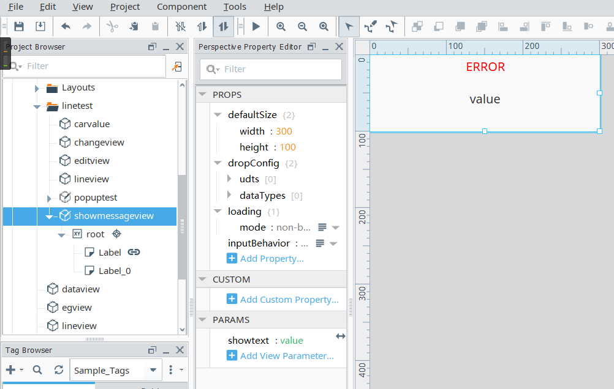
此处是绑定的label，如下图所示：
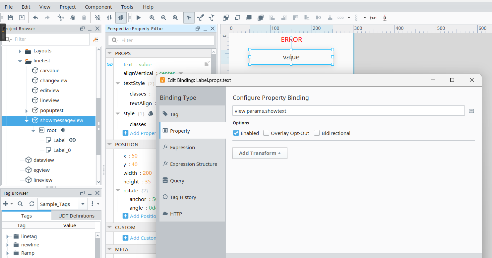

目前通过popup事件可以实现弹窗以及参数的传递，通过脚本执行弹窗操作，可以成功弹出窗口，但是参数的传递，没有找到方法（待解决/或跳过），如下是button按钮的popup事件配置：
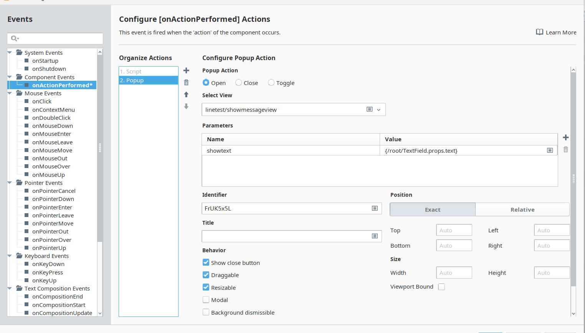
popup按钮，parameters中的name是被弹窗的窗口设置的参数，value是本视图中的需要传递的文本框的值。

可以弹窗的脚本代码如下所示：
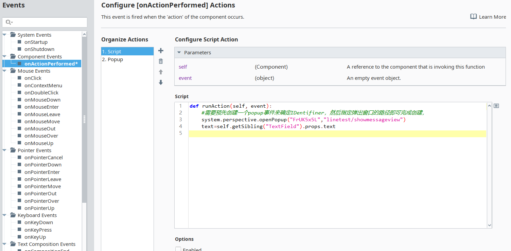

利用图片中对应的方法执行弹窗操作，同时，似乎需要先创建一个popup事件，再将事件中的identifier复制过来才能正确运行，否则会报错，

修改界面的逻辑改为没有提示弹窗的内容，因为没有直接的传递方法，判断界面中被选中的复选框数量为1时，按钮可以点击操作，否则按钮不可点击操作，然后正常弹出修改界面，修改界面的逻辑不变，只是减少了弹窗提醒的显示，

目前成功实现的修改界面弹窗逻辑，需要的设置如下所示：
修改按钮的代码如下：
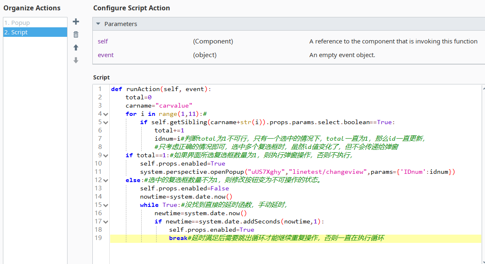

for循环遍历界面中的复选框，因为设置的显示carvalue的复用视图的名称是规律的，所以可以通过for循环组合字符串实现，idnum获取参数的逻辑如图所示，只考虑正确的情况即可。复选框选中数量为1，则进行弹窗操作，同时传递id参数给弹窗界面，params书写规则如下：
    system.perspective.openPopup("messageBox",'Popups/MessageBox', params = {'message':self.getSibling("TextField").props.text})
这是官网的示例代码，第一个引号参数对应的是popup中的identifier，已经提及过，第二个参数是视图的路径，第三个参数是设置，对应视图的params，即，被弹出的视图，changeview已经有自己添加的params参数，分号后面即传递给该参数的值，至此可实现，按钮对弹窗的传参。同时，被弹窗界面上显然的需要添加startup脚本，即，界面一旦被弹出，即启动该脚本。
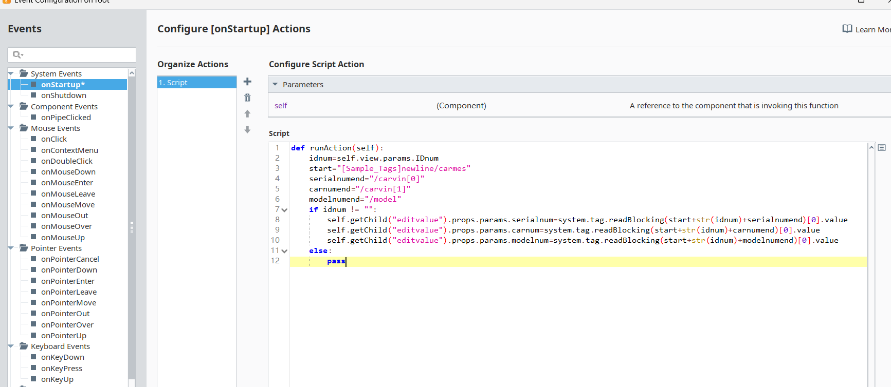

只是简单的赋值操作，不赘述。

id参数可以成功传递后，剩下的确认和还原逻辑就很简单，简单叙述，不再给出图片，设置确认功能，在弹窗页面设置按钮事件为，先获取编辑组件的参数，相当于获取文本框中的内容，然后将获取的值写入到id对应的tag上，因为tag和显示数组的组件是绑定的，所以数据会自动更新，，，，，，，还原逻辑，基本上相反，先获取id对应的tag上的值，然后将tag的值，写入编辑组件的参数中，相当于对文本框进行写入操作。

6.移动界面的逻辑--待验证：
目前，移动界面的逻辑是新的逻辑，即，设置头尾位置的下拉框来实现，移动的头和尾的选定，距离仍然同之前的逻辑，通过下拉框设置正负代表移动的前后，点击确认按钮，获取头尾下拉框选中的内容，移动距离下拉框对应的距离，符合头小于尾则弹窗提示移动成功，否则提示失败。取消掉弹窗，如果选择的头尾位置不对，设置对应的特效来表明操作失误，操作成功则没有提示。
移动的逻辑就行优化，或者说给出第二种做法，将移动的行为理解为抽取后放入，获取移动的距离后，每次加入一个判断，即移动后的数据是否在新区间内，不在就置空，否则不置空，如此解决移动距离过长，经过的位置会全部被置空的问题，移动的逻辑举例，如，234，移动到456，判断2是否在新区间，显然不在，那么2移动到4,2置空，3不在新区间，同理置空，4在新区间，4不置空；再如234移动到678,234都不在新区间，都置空，移动到新区间后循环结束。移动的数据流动逻辑可行，此处再进行抽象效果不大，没有复用的空间，直接平铺组件即可。

优化提醒的逻辑：下拉框飘红的操作发生在头尾位置下拉框的值发生变化时，或者说发生在对下拉框进行操作时，进行操作时则进行判断，头尾位置下拉框的值是否是尾大于等于头，否则都进行飘红处理，有一方为空的情况下都不做处理，头尾下拉框都添加此判断事件，确认按钮则是添加判断，有一个位置值为空，则点击失效，处理逻辑同修改按钮。不赘述。那么此处确认按钮对于非法的头尾位置就不需要考虑了。

~~移动逻辑同之前的区别：因为之前的界面存在可以编辑的文本框，文本框充当了一个临时存储数据的作用，现在因为使用了udt和批量创建视图，tag和label的值是绑定的，所以无法充当容器，需要增加一个newvalue用于存储后一个tag的值，如果后一个tag越界那么不执行这一步操作，需要在循环开始前新建两个变量用于存储当前的tag值和后一个tag的值，减1移动不需要考虑，前移和从小的开始遍历的思路是一样的。~~
移动逻辑的再修改：不用额外存储的移动过于繁琐和啰嗦，不再考虑，选择移动前存储移动的数据，然后再对数据进行移动和对应位置清空。也符合新的移动逻辑时抽取的概念，

移动界面增加头尾位置判定的颜色变化，如下图所示：原理简单，不赘述
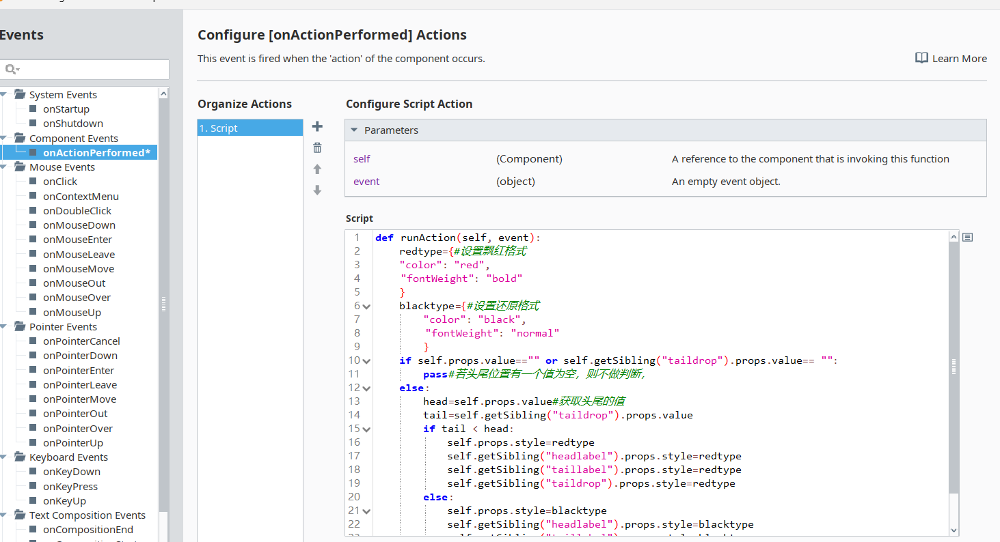