## 需求叙述
    做一个配置界面，配置“车型代码”和“车型描述”的对应关系，配置的信息能保存到数据库库中，每次保存一个版本。界面除了保存，可以恢复历史配置的版本。配置界面，支持30组车型代码配置

分析：支持30组车型配置，应有30个配置的组件，每次保存一个版本，需要配置组件可选，可编辑，数据库存储就是点击按钮后执行sql语句存入，（可考虑tag做中转存储，对应虚点的概念），~~车型代码的配置是一个文本框或者类似的控件编辑即可完成，还是需要多个控件组合完成编辑，以及，如果是配置的话，那么是需要预设几个选项来进行配置？~~////配置文本输入即可。

## 解决方法

1.类似的配置udt以及示例组件页面，此次考虑使用脚本批量生成组件，
思路：设置文本框和文本域用来获取输入的信息，同样添加复选框代表选中，以实现存储功能。批量生成组件减少重复操作。脚本批量生成非opc的tag应该不需要实际的设备映射，此次只是虚点，那么脚本生成是可以减少操作时间的，tag不代表一定就是实际的设备映射，

2.存储到数据库，目前考虑两种操作，udt绑定对应组件到tag中，点击保存按钮后，保存tag的值，考虑直接对应于tag的可读可写，因为有一个保存到数据库的操作。保存数据库需要设置sql查询

3.保存按钮，~~同样的逻辑，选中多个或0个都无法操作，选中一个时，弹窗配置组件，考虑做的稍微不同，或者相同？考虑车型描述需要的文本区域较大，保存完毕后将原来的位置清空？~~
保存功能的补充，对恢复的历史数据有个判断，无法再次保存。或者说是直接判断提供的保存标志位即可。flex repeater的数据传输逻辑和之前不同，需要通过事件来严格实现数据传输逻辑

4.清空按钮，清空选中的当前组件的数据，不会保存，清空可以清空多个组件，//或者一次只清空一个数据，///添加一个清空提示弹窗，显示清空的位置的序号，防止误操作？

5.saved标志，增加一个文本框或者说标志位来代表当前组件上的内容被存储到数据库中，点击保存按钮后，标志位变成以保存，否则都是未保存，如果是恢复过来的数据，那么也是已保存，其他情况都是未保存，点击清空按钮后，空置的组件自动变成未保存

6.恢复历史配置的版本，分析，首先，需要知道，从数据库中拿出来的是什么数据，那么需要查询，恢复到那个位置，或者说提供一个临时存储位置来存放，存放后是否移动到原来的页面？那么需要一个移动按钮以及移动到那个位置，或者通过复选框选中，点击移动后，将临时存储区域的值存入选中的位置并清空临时区域。

## 待验证功能以及提到的操作

1.脚本批量创建udt和view视图实例，目前已知可以通过脚本批量制造列表中相同的属性，
配置udt实例和view视图的绑定过程如下所示：

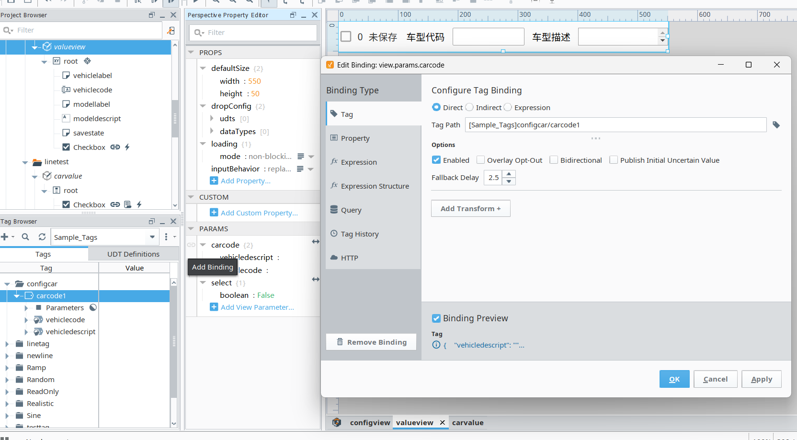

通过添加params里面的参数设置绑定，对应上实际创建的udt实例，因为udt定义无法利用参数进行绑定，绑定后取消绑定，（注意，预先创建的对象数据要设置成双向可读可写，否则无法绑定），取消绑定后会留下对应的udt实例的结构以及变量名称，添加的复选框组件的值，需要设置selected组件绑定到params对象，然后checkbox中的selected的值需要设置valuechange脚本，值改变，则将值写入params参数中，因为udt通过后面的dropconfig设置了绑定，值会自动传递，selected的值没有设置传递。

设置的对应tag的文本框同样需要设置绑定到模版视图的params属性中。只是没有写入操作。

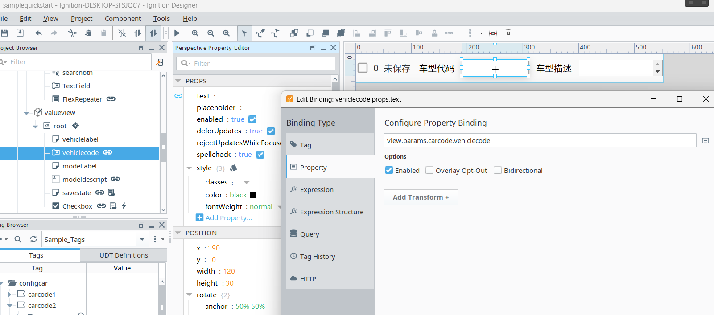

此处组件中添加了一个保存状态的标志位，那么显然此处的值同样需要参数来确定可以编辑。~~考虑参数传递值的情况用英文代替比较规范？~~仍然用中文，英文太长，同样的需要设置value change事件来确保参数的传递。

#### 代码批量创建tag的方法：
首先需要先创建一个udt实例，然后右键该实例，

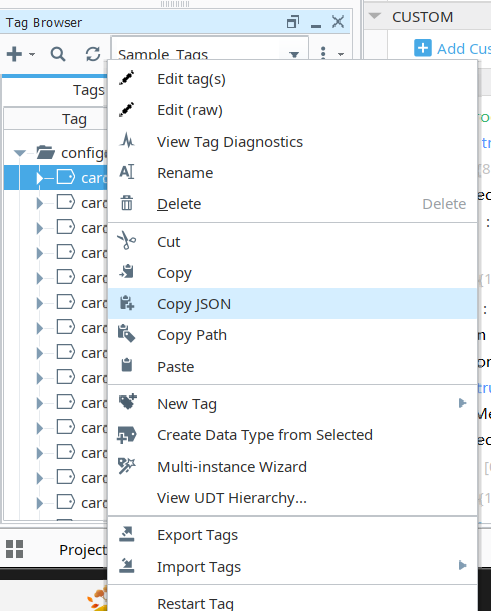

选择copy json复制相应的格式，然后代码如下，代码在脚本编辑器中编写。

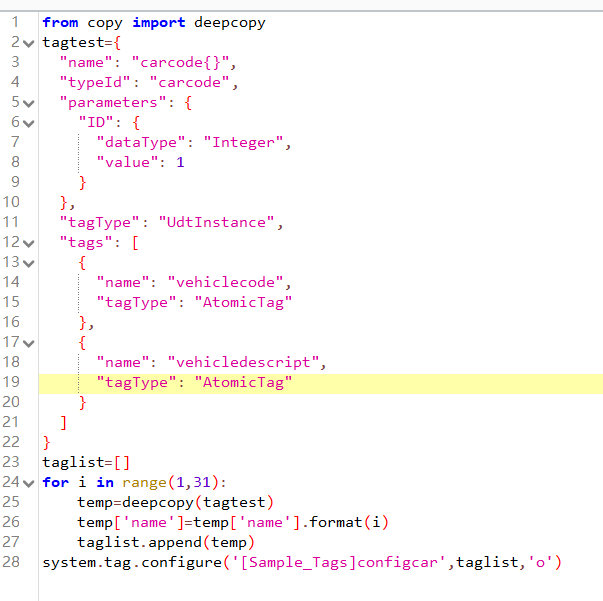

tagtest等于的是刚刚复制的copy json的结果，然后利用python深拷贝，即批量创建不同的tagtest值，并存入taglist数组中，然后利用system.tag.configure，执行代码，第一个参数是对应文件夹的路径，第二个是对应的需要批量创建的tag的json格式，第三个参数是冲突配置策略，o代表冲突时覆盖原有配置。

按照对应的思路，理论上来说，批量创建view视图是一样可行的，代码批量创建tag后的结果如下：

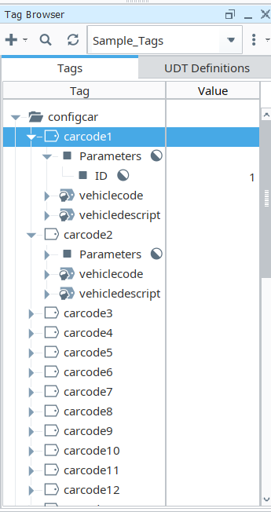

id参数虽然不对，但是批量创建的代码没问题，接下来是修改id的参数，（考虑之后实验一次代码完成tag创建和id修改，目前跟教程走。）

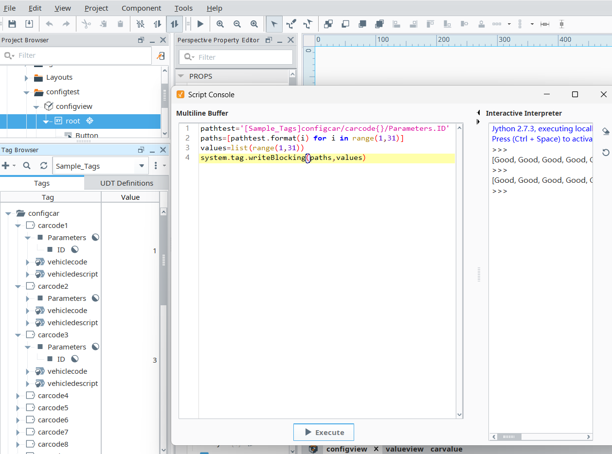

代码如上图所示，已经成功修改了id的值，操作为，复制id的path，然后利用代码，批量将生成的id值写入对应路径的tag中。

udtpath=system.tag.browseTags(
	parentPath="[Sample_Tags]configcar",
	filter={"tagType":"UdtInstance"}
)#可以成功获取对应文件夹下的所有tag路径

#### 批量创建view视图的方法：

代码直接创建view视图不可行，需要通过flex repeater组件，才能设置被批量创建的组件，此时view模版视图已经相当于一个视图里面的属性了，接下来应该使用类似的方法就可以批量创建模版view视图。

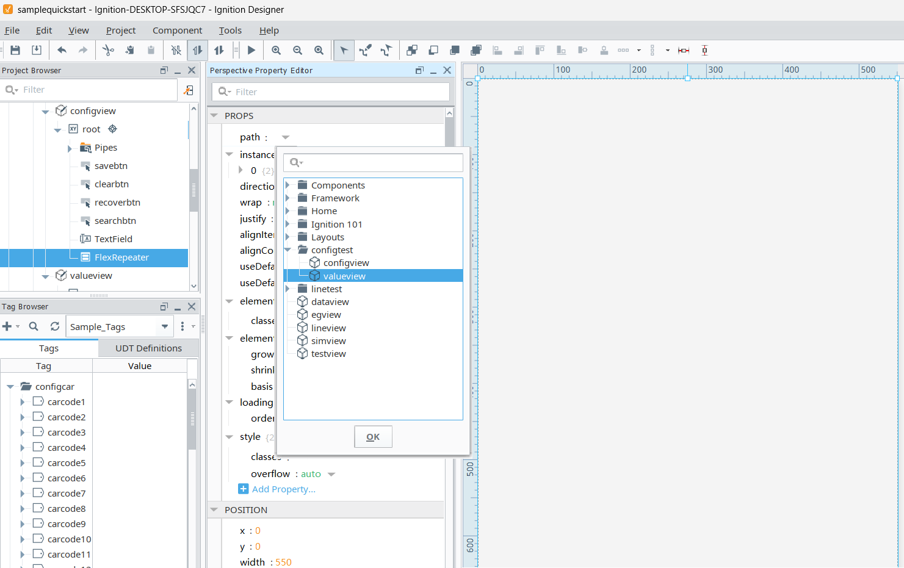

操作如上图所示，创建flex repreater容器后，选择path，点击需要创建多个实例对象的模版view

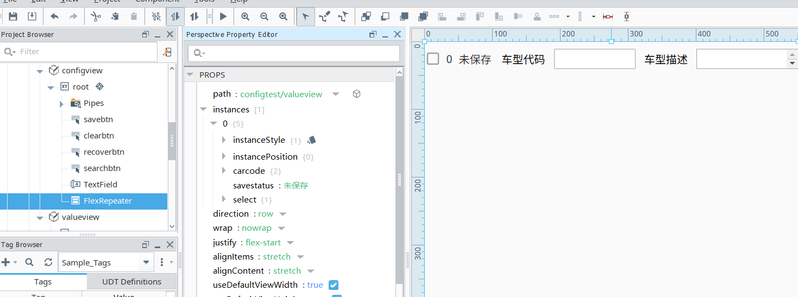

创建后需要添加模版视图原有的参数用于传递数据，接下来是仿照网上教程的操作。

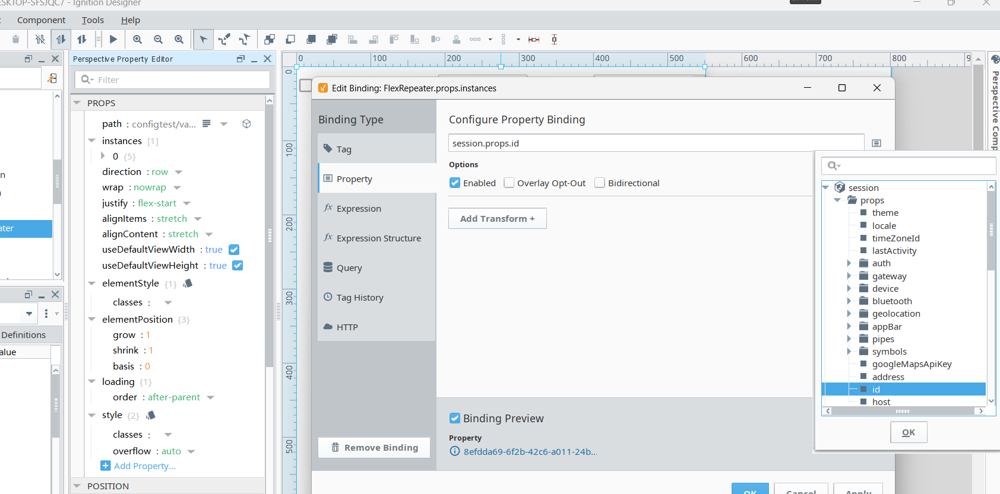

如图所示绑定到session.props.id属性上

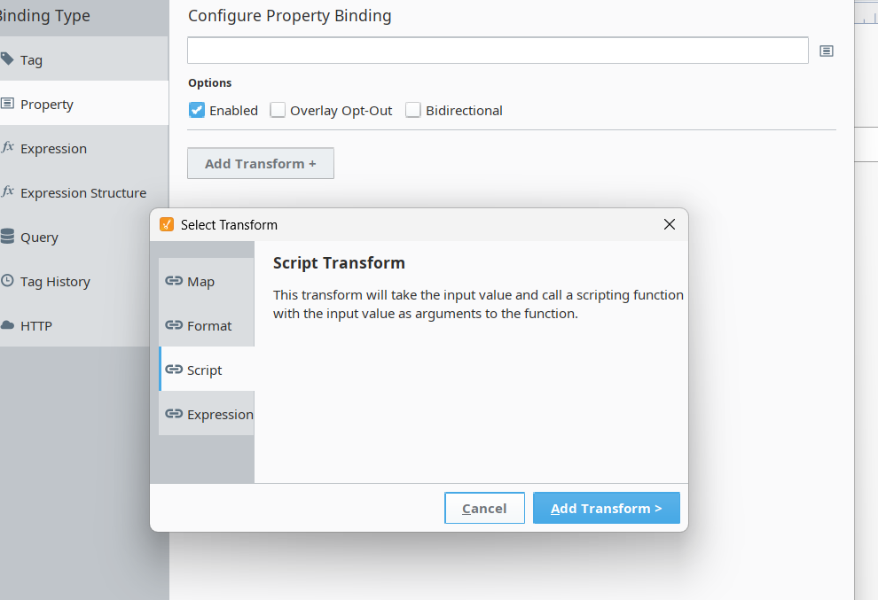

然后添加tranfrom转换，此处是示例，转换里面选择脚本script，代码及注释如下所示，不再给出截图。demo复制的是第一个手动添加的instance实例的值，即，instance点击+号后会自动添加一个实例，相关参数添加完毕后，右键该实例点击复制，即可复制对应的值。

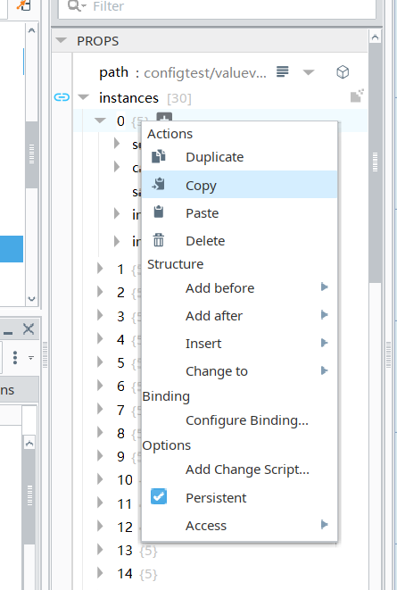

	def transform(self, value, quality, timestamp):
		from copy import deepcopy
		demo={
	"instanceStyle": {
		"classes": ""
	},
	"instancePosition": {},
	"carcode": {
		"vehiclecode": "",
		"vehicledescript": ""
	},
	"savestatus": u"未保存",#含有中文字符需要在字符串前加u
	"select": {
		"boolean": False,#布尔值需要设置正确的True和False格式字段
		"num": "{}"#需要类似于自增的id可以通过｛｝解决
	}
	}
		result=[]
		for i in range(1,31):
			temp=deepcopy(demo)
			temp['select']['num']=temp['select']['num'].format(i)
			result.append(temp)
		return result

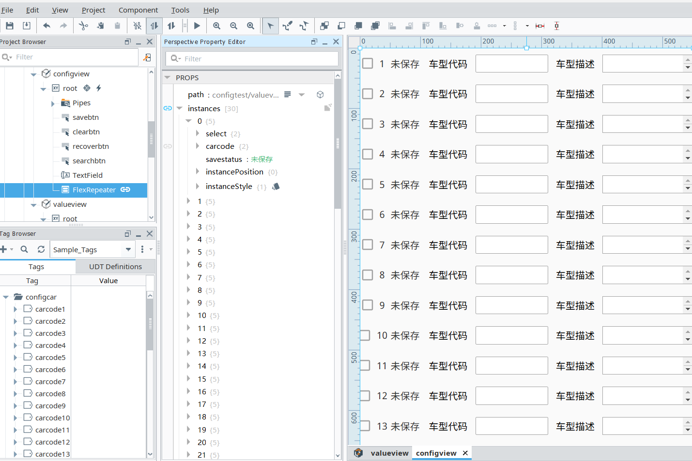

保存后，这是效果界面，可以看到已经批量创建了对应的view视图模版，如果格式不对，最开始可能是按列显示，调整成按行显示即可从上至下一次看见。

#### 批量视图和udt数据之间的传输问题：
在新的空白view上，通过拖拽udt实例到view视图上时，数据仍然是绑定的。通过flex repeater批量生成时，绑定关系失效。~~原因待探究，~~先说解决方案，在此的基础上，对需要输入数据的文本框添加value change脚本事件，一旦文本框内的值改变时，因为tag是规律的，且id和复选框id相同，所以，值改变时直接通过读取复选框的id获取tag路径，然后写入对应的tag中。代码示例如下：

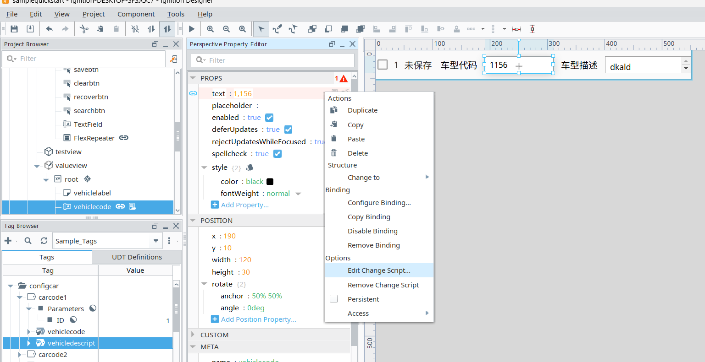

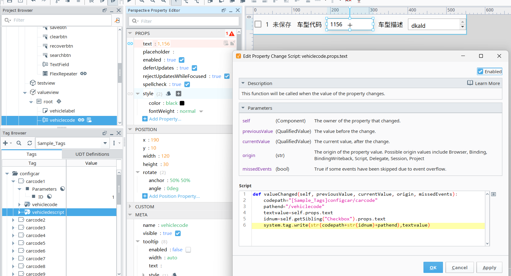

数据传输失效的问题如下图所示：

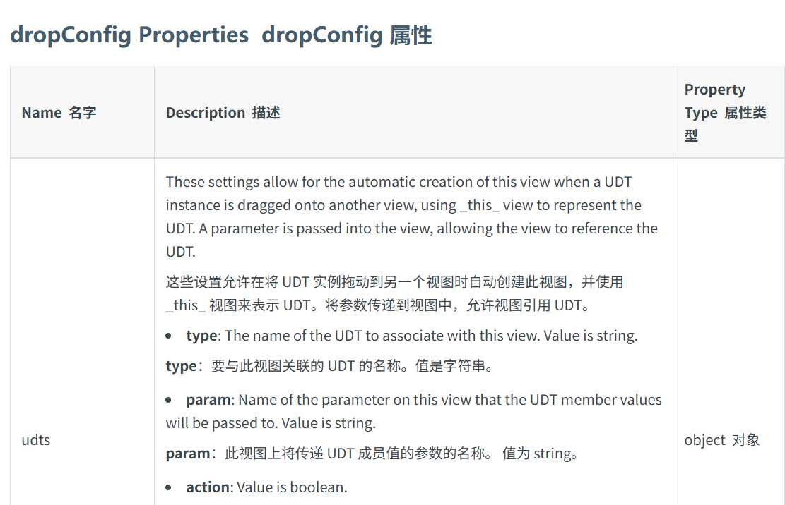

因为对模版视图设置了dropconfig中udt的绑定，所以在拖拽时可以自动实现数据绑定的功能。设置flex repeater时不是通过udt实例的拖拽实现的，那么自然也就没有了绑定数据的功能。

在flex repeater环境下，因为失去了提到的自动绑定功能，所以文本框与参数之间的数据传递要全部靠代码写入，举例，在模版视图的车型代码中，因为设置了text绑定了params参数，所以修改params参数时，即使是在flex环境下，依然生效，理解为一个从text指向参数的指针这样，参数被修改，那么因为绑定关系，text会跟随修改，但是直接修改text时，设置了文本框对应于tag的value change事件，所以tag会跟随修改，因为触发了事件将值赋给tag，但是，没有赋给参数的行为，所以在文本框输入时，params参数值不会改变，需要在value change事件中同样添加赋值，此时，文本框到tag，与params参数的数据流动可以成型，params参数也可以到文本框和tag，但是tag还不能同步数据到其他参数中，/////tag数据与其他数据的同步可以通过设置params参数绑定到tag上来解决，又因为此时绑定是在flex的层面，所以显然的，复制，不能将绑定关系一起复制过去，~~~~那么似乎只能手动绑定。~~应该同之前一样，可以通过设置表达式来一起绑定，之后再考虑表达式绑定，先做功能。

2.sql查询以及连接的详细记录：...先做这一步，脚本批量放在sql之后，数据库记录要确定相应的字段，然后才能存储，根据字段，再反过来设计udt和视图。根据需求，需要一个车型代码vehicle code 数据类型应该为string类型，还有一个车型描述modeldescript也为String类型，加上一个自增的id序号，用来计数，数据库结构完善后，通过保存按钮实现数据存入数据库的过程。

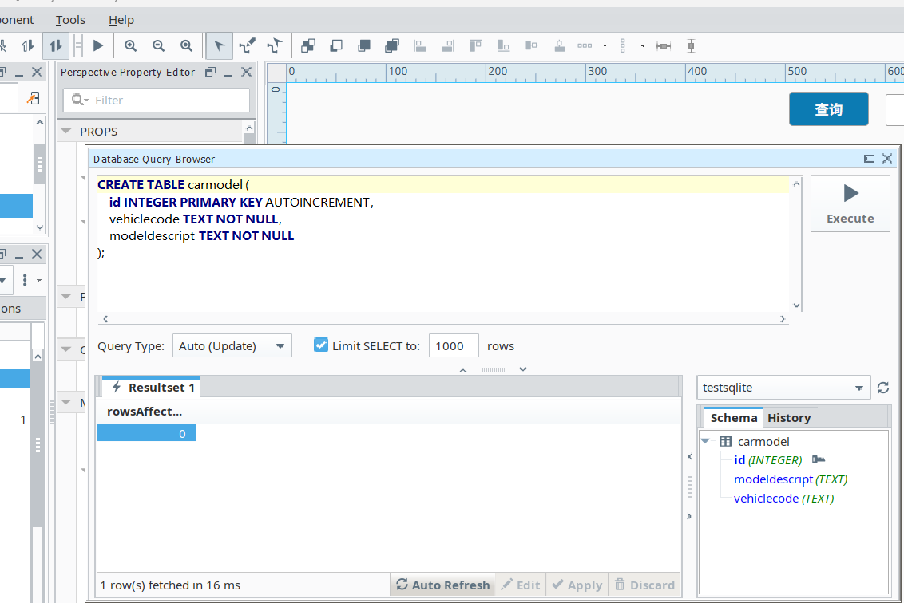

sqllite数据库创建成功，需要网关中对应的sqllite连接并在ignition界面的database query查看。

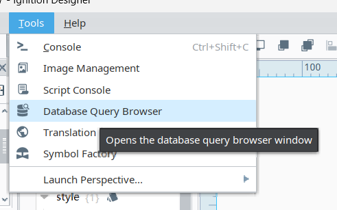

#### 查看数据类型的方式：
目前摸索得知的一种方法是利用system相关函数输出内容，然后可以在网关的日志界面查看

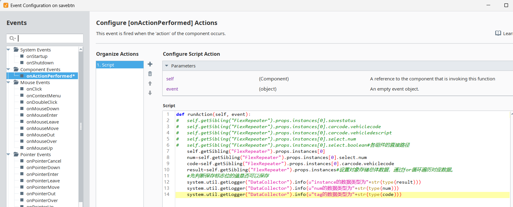

#### 保存按钮的具体逻辑：

选中的判断仍然是通过循环判断是否选中，按钮点击后，必须先轮询判断复选框的选中数量，然后判断文本框是否为空，若文本框存在为空的，则按钮不可选，只有文本框都有内容时，才会进行数据库的写入操作，，，，，在文本框有内容为空时，可以考虑利用传参实现对style样式的修改，此效果设置为待定，暂时用按钮不可选操作代替。.....数据库写入利用相关的函数进行操作，获取文本框内的内容，然后利用sql语句执行写入数据库的操作，数据库写入操作总结如下：
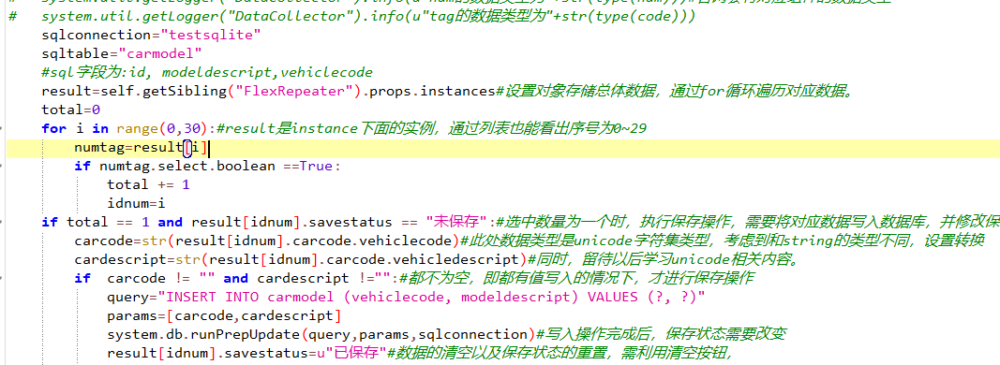

实际应用代码如上，利用system.db.runPrepUpdate(query, args, [database], [tx], [getKey], [skipAudit])函数实现sql语句的执行，query对应与sql语句，args对应于参数列表，用于匹配？占位符，database代码数据库连接的名称，用字符串形式的名称即可，此处database外面的方括号是多余的。后续几个参数可查看官网详细解释。官网解释如下：
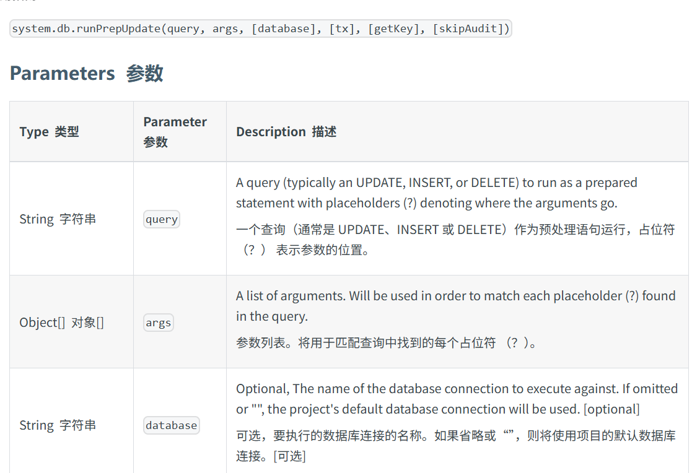

#### 清空按钮的逻辑：
此按钮逻辑较为简单，点击后可以清空选择的所有复选框对应的文本框，同时将保存状态重置为未保存，设置按钮的目的是考虑到配置的情况下可能有多个配置进行输入的情况，减少一定的操作量，以及对于数据是否保存的状态的改变。////因为清空涉及多个区域同时清空，考虑增加弹窗提示？是否有必要，清空的主要目标是重置保存状态，次要目标才是将文本框输入区域清空，毕竟这个功能人工也能实现，只是如果配置过多时减少了一定的操作量。从需求上来看，似乎不需要提供弹窗确认，已保存的数据，已经写入了数据库，清空与否不影响，未保存的数据，如果被清空，且存在忘记保存的情况，那么提供了查询功能用于查询，//////清空后，需要重置复选框的状态，排除逻辑上可能的误操作。
	补充：因为清空的逻辑是直接修改复选框的值，没有点击操作，所以需要修改事件所在位置，改成在属性里面的value change事件，而不是视图界面的触发事件。代码都是一样的，不赘述。

#### 恢复按钮的逻辑：
简化一下此按钮的功能，仅仅为从历史数据中拉出最后存储的一次数据，显示到临时存储区即可

#### 转移按钮的逻辑：
用于将临时存储区的数据转移到列表中，同时列表的状态设置为已保存，并清空临时存储区的数据。

#### 查询按钮的逻辑：
根据文本框内输入的内容进行sql查询，目前只考虑符合条件的情况，考虑扩展的话，需要设置弹出界面展示详细的查询结果，在弹出界面设置复选框，将选中的内容转移到临时存储区在进行后续操作，目前先考虑单个数据的逻辑。单个按钮的逻辑已完成，简单记录下逻辑，增加了判红的逻辑，输入数据完成后，数据查询返回无结果则判红，否则不变，同时设置文本框为空时，还原文本框样式为黑色，确保重新输入时，数据样式正常。

### 弹窗传递参数给主页面（待解决）：

思考需求过程中，都有涉及到将弹窗的数据，传递到主页面中来，考虑对其进行解决，暂且列出。

### 目前存在的问题：
#### tag的数据改动
tag的数据改动无法反馈到params参数和文本框数据上。保存时，对文本框未写入数据进行飘红提醒，查询功能可以扩展成，弹窗生成查询到的所有数据，在列表中，选择想要的数据后，再点击数据返回到临时存储区中

~~1.飘红处理，可以设置value change脚本，文本框值改变时则进行检测，若同时复选框选中了，则进行判断，未输入数据的文本框前面的label进行飘红处理，复选框未选中时，则不进行判断~~通过保存状态的颜色改变来代表操作的正确与否

2.弹窗的查询列表，考虑怎么返回数据到按钮或者说是主界面中，

3.tag的自动绑定。////~~~~暂未找到解决方法，，只能通过手动绑定完成tag数据的改动对应上其他的数据。~~修改初始模版view视图页面的绑定关系，设置text的值绑定到对应的tag上，然后在批量生成的view视图里面，设置params参数的值会赋值给text和tag，之前的逻辑是text与模版视图的params参数绑定了，实际上是有一定重复的，因为params通过代码生成，也一样具有赋值的能力，代码生成时没有利用上赋值的能力，所以无法完全实现对应数据的绑定。（对应到实际opc点上时似乎会有问题，目前是虚点所以不考虑。）现在的逻辑是将text的绑定对应上tag的值，那么此时相当于tag和text是一个变量，同时，text具有写入params的能力，params具有写入tag的能力，那么数据就完成了一一对应。
设置text绑定自动递增的tag：
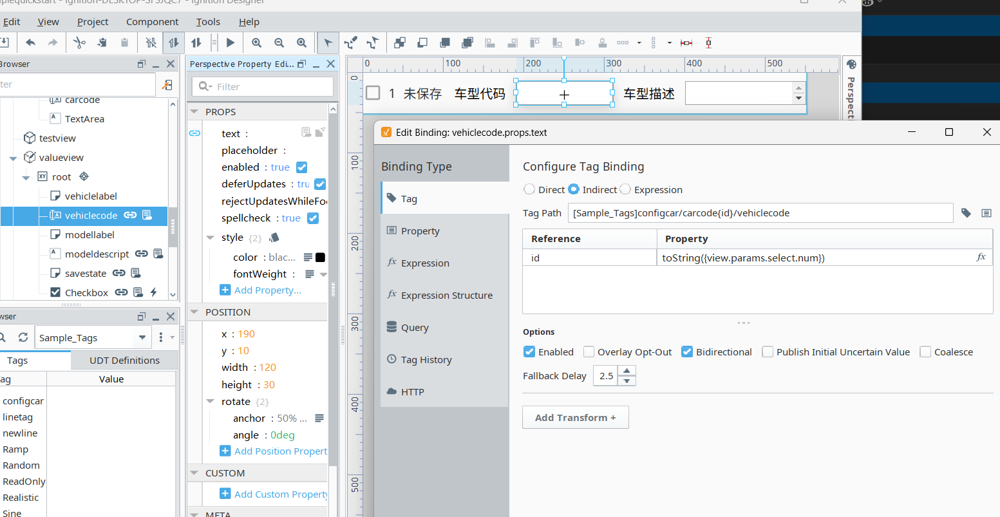

首先修改props中的绑定，要点击text属性旁边的链接样式图标，在tag页中选择间接绑定，即indirect,先在tagpath中输入一个预定的tag路径，然后设置其中需要变化的量变为｛｝，并添加变量名，添加变量名后，下面会自动弹出id这个变量的参数，设置其属性，即预想的需要赋给变化的id的值，此处需要选择视图属性里面的num属性，即整个模版视图中，自己添加的num参数，因为最后，此num参数是通过代码脚本进行赋值的，这个num就是自增的变量，同时，需要在下面的设置中，设置属性为双向写入，即Bidirectional需要勾选，这个选项代表数据写回。注意，属性里面需要设置一个tostring的类型转换，因为此处需要的数据显然的是字符串类型，而num虽然是复选框中的序号文本，但是稳妥起见增加一个转换的步骤，因为默认输入序号的时候会提示报错，给了一个整型，但预期是字符型。那么到目前为止，text的绑定关系已经修改为绑定到tag上了，只要修改tag，那么text文本也会自动修改。

因为模版视图的参数本身也是可以添加脚本的，所以下一步就是在模版视图的param参数中添加value change脚本，每当param参数值改变时，将值写入到tag中，因为tag和text的绑定关系，会自动写入到text中。脚本如图所示：
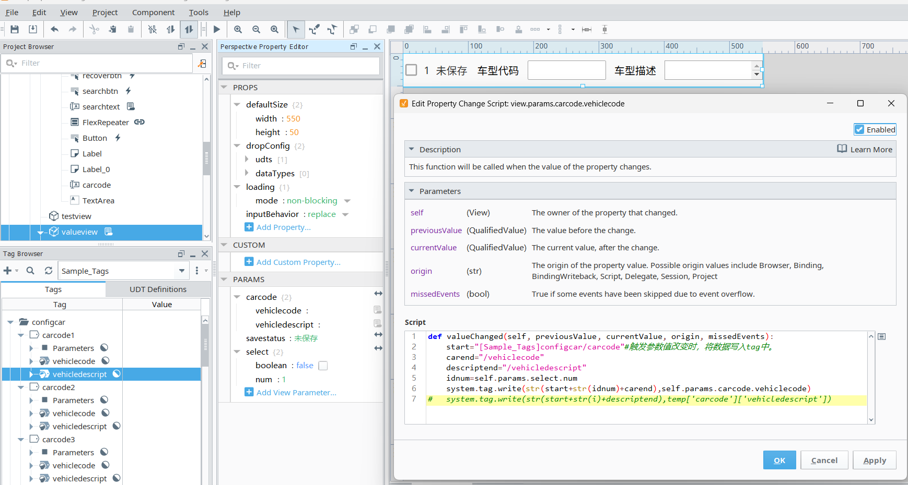

对于text序号期望类型不一致的解决方法，添加一个转换脚本或者类似的利用表达式的tostring应该也是一样的，代码如下图所示：
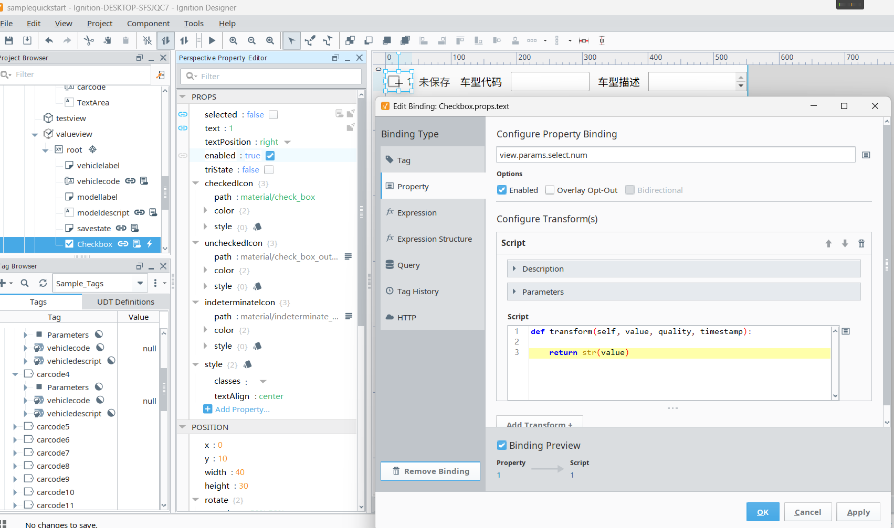

