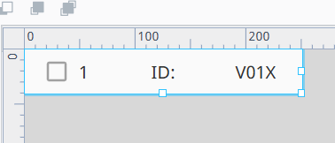
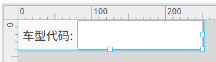
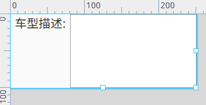
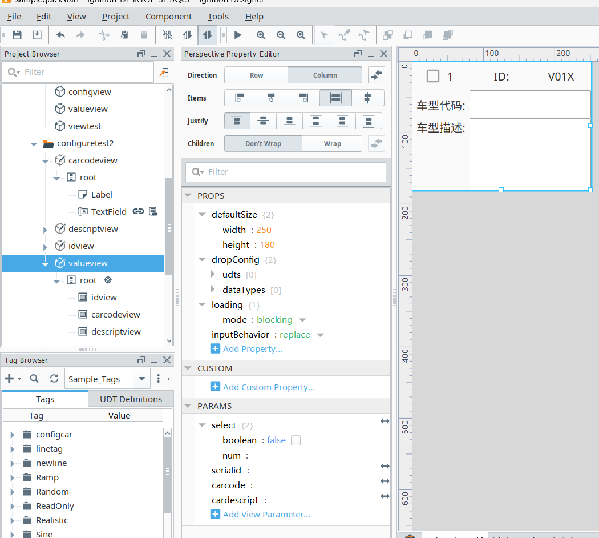
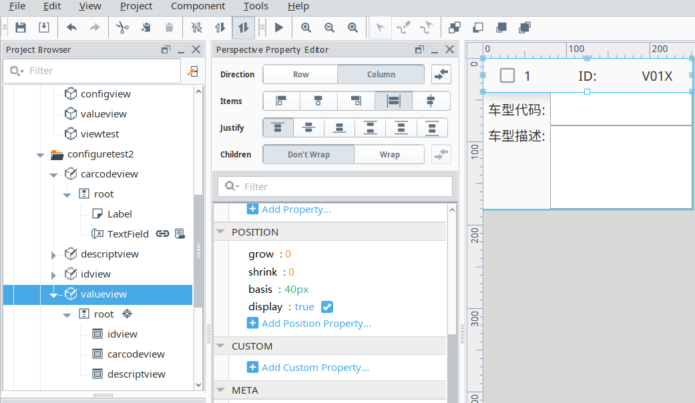

## 需求：
做一个配置界面，配置“车型代码”和“车型描述”的对应关系，配置的信息能保存到数据库库中，每次保存一个版本。界面除了保存，可以恢复历史配置的版本。配置界面，支持30组车型代码配置
    补充：id字段，车型配置的id，加上时间戳，按时间戳恢复，打开时，显示最新的时间戳数据，30个整体保存，配置页面数据是整体的，

分析：仿照工厂实际页面的网址，设计一个下拉列表，列表中的每一页对应于每一个完整的配置页面，下拉树中存在一个主页面，可在主页面直接保存，保存直接保存到数据库中，对应于数据库中的一行数据，页面中的数据，每行三个模版视图，模版视图中有独特的id，具体规则后续再写，保存后将数据记录到数据库中并记录时间戳，同时弹出窗口，是否另存，并提供文本框输入相关页面标题，点击确定后另存为一个下拉列表中的新页面，标题即为输入的标题。///////先预留此新建页面的想法，若无法实现，则再考虑只有单个主页面的做法，/////////页面本身包含30个配置区域，一行有三个配置区域，总共10行，页面最下方存在保存按钮，根据时间戳恢复历史数据，时间戳设计成下拉框的样式？或者是通过文本框输入时间，通过文本框输入，那么具体的时间仍然有待确定，需要一个二次确定的步骤，二次确定考虑变成弹窗展示，展示相关的时间，同时下拉框样式的时间仍然保留，按天或者小时显示最近的时间戳版本。增加清空按钮，清空当前页面的所有数据。导出按钮，可以导出当前页面的数据为excel表格形式，具体逻辑和操作待完善。

对于没有新增页面的情况，保存后，弹窗提示数据以保存，或者同样的增加标志位表示当前页面数据是否保存。

对于新增页面的情况来说，那么本质上没有必要真的去添加页面，将展示的嵌入式页面的数据替换为其他页面即可。新增页面变成下拉列表中新增一个节点即可？？？数据替换即可，那么嵌入式页面需要可复用，整个配置页面只存储数据，同时配置页面添加按钮方便操作，依旧添加弹窗提醒？暂且想到这里，先完善其余部分，后续留待慢慢补充。

### 需求的细节拆分

首先是考虑复杂的情况，即需要动态生成下拉表标签的情境下，拆分出来的具体需求：
1.树形菜单的动态生成：按预想的思路来做的话，需要树形菜单根据保存弹窗返回的数据，来定制化生成一个树形菜单的子项，子项有其对应时间戳的数据，拿到数据后，返回给嵌入式页面组件页面组件，通过返回的时间数据等，执行数据库查询，然后将数据显示在对应页面，具体思路待定。

2.复用页面：由复用组件和各种需要的按钮组成，复用的view组件包括独立的id，车型代码，车型描述，考虑布局是否优化，以及，考虑仍然利用flex repeater 进行批量组件的代码生成需要调整对应的位置，页面中还包含有各种按钮，按钮暂时待定为保存和清空，导出按钮仍然放置在嵌入式页面内，方便导出功能的实现，整体页面外部添加一个下拉框，下拉框内设置小时格式的时间戳？或者固定为最后几次存储的数据的时间戳格式。/////查询和下拉框考虑做在整体页面的外部，因为这不是对页面内数据的原子化操作？是整体数据的一个宏观的操作？其他的保存，清空，更新，导出，可以扩大到对整体页面的操作，但是没必要，

3.查询按钮及其相关功能的实现：查询功能考虑的是更精细化的数据查询，具体实现逻辑留待解决。////////查询功能的实现依靠弹出的窗口显示列表数据来解决，那么查询只要按钮即可，输出放在弹出的列表窗口中，又因为要满足一次显示一整版的数据，此功能只有根据时间戳的查询可以实现，所以考虑增加一个时间查询框？只提供对时间的查询，同时查询界面的按钮只允许一个输入框有数据，显示对时间的查询结果后，若需要反馈到主页面，则需要点击确定？同时判断列表内的数据是否刚好满足30个，不满足则弹窗提示，将时间查询更精细化？

4.更新按钮，可对页面数据进行更新，必须是以保存状态的数据，选中才会有效，暂时只考虑对一个数据进行更新，考虑弹窗进行更新，利用之前分化好的组件值更新选中的数据即可。更新后，整个页面的数据保存一个新的时间戳数据，

5.保存按钮，实现点击该按钮将当前页的数据保存到数据库中，同时保存标志位改变为以保存，仍然加入未填写完成按钮会失效的提示逻辑，（考虑增加弹窗提示的逻辑）,考虑每次保存后，更新下拉框菜单内的内容，每次存入数据后，重新执行一遍sql distinct语句，

6.清空按钮，将当前页面的数据清空，同时设置保存标志位变化，清空情况下，对应需要有一个恢复按钮，可以恢复最新的数据，到当前的页面中。

7.导出按钮，导出当前页面的数据，导出功能的具体细节待定，

8.时间下拉框菜单，考虑到保存表的时间同样会存在相同小时甚至分钟的情况，~~那么下拉框需要确定一个范围，需要有起始时间和结束时间，~~考虑到不同时间段存储的数据量不同，确定范围也不一定有效，下拉框提供最后10次的时间戳的数据，即，数据库最后300条数据，这里可以使用mysql中的distinct字段，返回不重复的记录。

9.恢复按钮，点击后，获取当前页面时间戳的数据，并将对应数据显示到配置文本框内。

### 难点以及待验证的思路

#### 1.flex container的进阶应用？

若需要利用flex container实现横纵都有数据排列，官网给出的方法是flex嵌套，即，将横纵的排列拆分为只有行的排列，一行包括多列，每一行利用flex container包含需要的元素，理论上同样可以应用代码批量生成，此处不作考虑，横纵排列的目的是为了实现配置区域的块概念？仅针对这一想法做延伸以及扩展。将原本只能一行排列的各项数据拆分成各个行，拆分后的各元素如下：

每个单独的组件仍然需要添加params参数进行数据的传递，因为是重复的内容，此处不赘述，仅作简单介绍，组合后的可复用组件如下图所示，同时给出对应的页面配置：

对于整体布局，配置如上图所示即可，同样需要添加全局参数以供继续进行参数传递，flex container的相关配置，可以参考css中的flex box的相关内容，或者ignition官网中亦可，对于目前的一些属性的应用参考如下图，设置grow，和shrink值为0，那么里面的container不会再跟随容器的大小进行变化，此时设置basis属性，可以调整，布局选项中的另一个维度的大小，即，此时设置的是column属性的调整，column对应的是列，但是此时basis属性调整的高度，选择的row，调整的则是宽度。

#### 2.特殊id的设计与实现？

id考虑利用界面本身的位置id以及增加分布式id的设计？分布式的id考虑增加一个雪花算法的id和uuid添加到数据库中？那么数据库应该是需要使用mysqlworkbench，考虑实现对应的功能，先在pycharm上验证一遍，位置id是对应于界面上的参数，多余的分布式id考虑在进行保存操作时生成并添加，考虑可能的不兼容问题，ignition环境下可能存在无法导包的情况，,,,,考虑只用uuid代替特殊的id，雪花id导包有问题，考虑手写代码仿照完成，同时考虑如果雪花算法能实现，导包到ignition环境应该怎么操作，后续可以考虑，目前暂定做法，利用uuid完成此特殊id的实现，创建sql数据库即可。

### 可行度高的操作及相关复用

#### 1.复用界面的搭建

此处复用界面即展示数据的主页面，包含展示数据的flex repeater组件，目前flex repeater是3\*10的横竖排列，可能考虑后续调整成5\*6的排列状态，此处暂且记下，当前复用页面存在的按钮，暂定为保存，清空，更新，导出，具体功能在需求拆分阶段已逐步完善，考虑增加页面整体的保存标志位，复用页面需要添加一个保存时间的标志位来方便查询的操作，
##### 复用界面内部的按钮

###### 1.保存按钮的具体实现逻辑及做法介绍：

首先需要对当前页面的数据进行检测，出现空白配置则考虑增加弹窗提醒或者按钮不可操作的提醒？同时，若符合保存条件，即，30个配置框都存在数据，此时进行写入数据库操作时，需要写入位置id，即配置页面对应的id，以及文本框内的内容，增加uuid生成算法，获取当前时间戳，时间戳是30个数据共用的，uuid是每条数据都单独有的一个新增的索引，数据库写入操作完成后，需要修改当前页面的保存状态标志位，保存后修改复用界面外的下拉框的内容，此做法暂时空置，留待难点里面解决，初步分析涉及嵌入式页面的双向数据通信。

保存时，因为存在30个数据的统一提交，涉及到更高效的插入数据的方法，此处去学习mysql中事务的相关概念。/////利用mysql中的事务，一次性执行多条插入语句，减少可能的性能要求，因为事务需要设置延时，所以在连续点击的情况下，会出现数据无法保存的情况。对此不必过多考虑，因为这是保存状态相关的判断，同时，保存按钮点击后需要将当前数据的保存时间写入到对应的标签中，表示当前页面的保存时间，
    保存标志位和保存时间记录：这两个标志的内容比较简单，和保存按钮写在一起说明，保存标志位，每次保存时将状态修改为 save-status ，若状态已为保存状态，则弹窗提示无法操作，保存时间的更新同样发生在保存操作执行完成后，时间的更新通过再次执行sql查询获取，直接获取最后一次数据的更新时间，同时，其他涉及到存储数据的操作，如更新等，都会执行保存时间的变化。
复用页面内的相关标志位只和当前复用页面的数据相关，以此来实现页面分割显示的做法，整体的还原考虑设置了树形菜单后，根据树形菜单的控件进行还原。
#### 2.复用弹窗的实现以及提示词的存储或设置：

复用弹窗考虑采用之前的简易设计？提示词考虑设置区分正确和错误的提示词，通过弹窗传递包含各种信息的字符串，来代表当前弹窗对应的实际状态。同时，不同的实际状态，设置的弹窗显示内容的样式也不同。提示词内容列举如下：
    保存成功
    存在空置输入区域，
    当前数据已保存，

